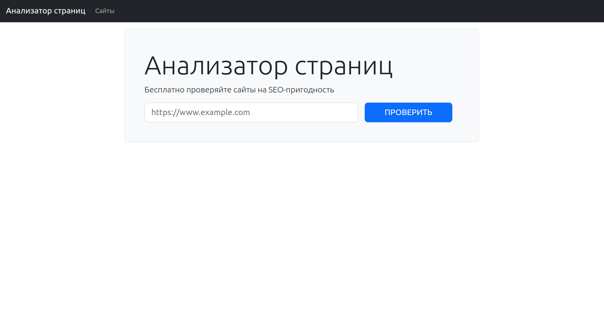

***
# Page Analyzer
***
### Hexlet tests and linter status:
***
[](https://github.com/GriNiki/python-project-83/actions)
[](https://github.com/GriNiki/python-project-83/actions/workflows/linter-check.yml)
[](https://codeclimate.com/github/GriNiki/python-project-83/maintainability)
***
## About
***
Page Analyzer is an application that analyzes specified pages for SEO suitability. When checking a web page using Page Analyzer, the application will extract several HTML tags that are important for SEO.

[Example of an application uploaded to Render.com](https://page-analyzer-wz50.onrender.com/)
***
#### Minimum requirements:
This app works on Flask framework and uses Gunicorn as WSGI Web server, so you need to get them installed, as well as other dependencies:
* python = "^3.10"
* poetry = "^1.4.2"
### Usage
***
##### Clone the repository using this command:
```
gh repo clone GriNiki/python-project-83
```
##### Database
***
This project uses PostgreSQL. For the application to work correctly, you need to deploy a local database. Create a DATABASE_URL entry in the .env file
```cfgrlanguage
postgresql://[user][:password]@[hostname][:port][/dbname]
```
It is also necessary to add SECRET_KEY to the .env file.
```cfgrlanguage
SECRET_KEY=yoursecretkey
```
Now, using the Make command, you need to deploy the server locally or run it on an external server.
##### Make commands
***
* ```make install``` - install poetry packages
* ```make build``` - starts the app on the local server in the development environment
* ``` make start``` - start the app in the production environment


